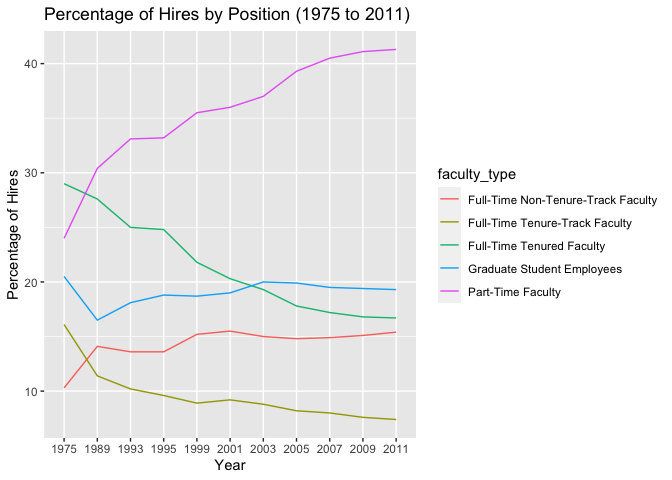
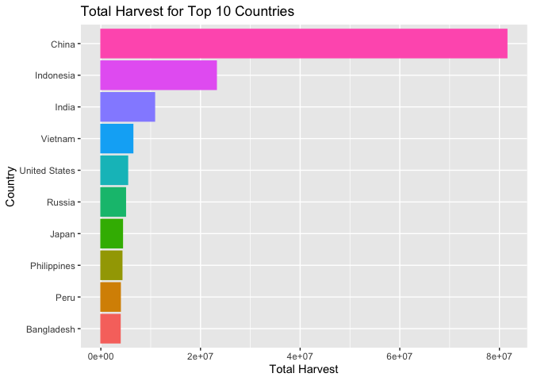
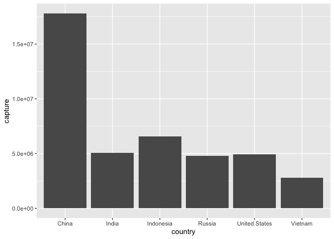
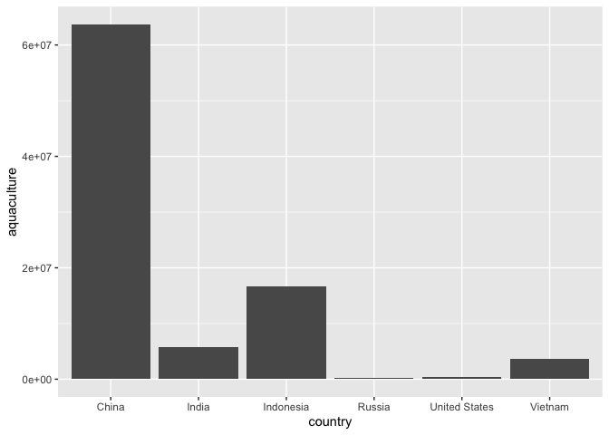
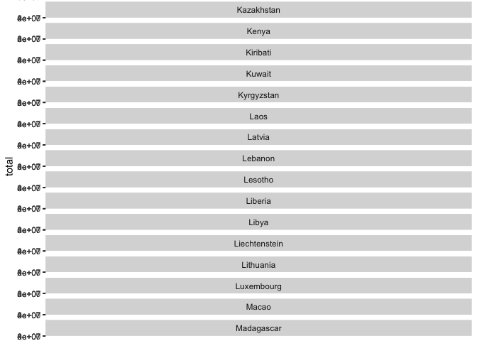

Lab 06 - Ugly charts and Simpson’s paradox
================
Sophie Boyd
2-26-26

### Load packages and data

``` r
library(tidyverse) 
library(dsbox)
library(mosaicData) 
```

### Instructional Staff Employment Trends

``` r
staff <- read_csv("data/instructional-staff.csv")
```

    ## Rows: 5 Columns: 12
    ## ── Column specification ────────────────────────────────────────────────────────
    ## Delimiter: ","
    ## chr  (1): faculty_type
    ## dbl (11): 1975, 1989, 1993, 1995, 1999, 2001, 2003, 2005, 2007, 2009, 2011
    ## 
    ## ℹ Use `spec()` to retrieve the full column specification for this data.
    ## ℹ Specify the column types or set `show_col_types = FALSE` to quiet this message.

``` r
staff_long <- staff %>%
  pivot_longer(cols = -faculty_type, names_to = "year") %>%
  mutate(value = as.numeric(value))
```

``` r
staff_long %>%
  ggplot(aes(x = year, y = value, color = faculty_type)) +
  geom_line()
```

    ## `geom_line()`: Each group consists of only one observation.
    ## ℹ Do you need to adjust the group aesthetic?

<!-- -->

``` r
staff_long %>%
  ggplot(aes(
    x = year,
    y = value,
    group = faculty_type,
    color = faculty_type
  )) +
  labs (x = "Year",
        y = "Percentage of Hires",
        title = "Percentage of Hires by Position (1975 to 2011)") +
  geom_line()
```

<!-- -->

If the objective of this plot was to show that the proportion of
part-time faculty had gone up compared to other positions, I would make
all of the lines one color except for the part-time faculty line to make
it stand out. I would also change the title to highlight the comparison
between part-time hires and other positions.

### Fisheries

To improve the first plot, I would change the scale on the y-axis or
exclude a high outlier to make the trends at lower total harvest values
more visible. I would also use a bar graph instead of a density
distribution to provide a better comparison between the total harvests
of different countries. For the other two plots, I would also opt for
bar graphs instead of pie charts because they would be easier to read
and I am personally more interested in comparisons between countries
than contributions to the whole.

``` r
fisheries <- read_csv("data/fisheries.csv")
```

    ## Rows: 216 Columns: 4
    ## ── Column specification ────────────────────────────────────────────────────────
    ## Delimiter: ","
    ## chr (1): country
    ## dbl (3): capture, aquaculture, total
    ## 
    ## ℹ Use `spec()` to retrieve the full column specification for this data.
    ## ℹ Specify the column types or set `show_col_types = FALSE` to quiet this message.

``` r
filtered_fisheries <- fisheries %>%
  filter(country %in% c("China", "Indonesia", "India", "Vietnam", "United States", "Russia"))
```

``` r
filtered_fisheries %>%
  ggplot(aes(
    x = country,
    y = total
  )) +
  geom_col()
```

<!-- -->

``` r
filtered_fisheries %>%
  ggplot(aes(
    x = country,
    y = capture
  )) +
  geom_col()
```

<!-- -->

``` r
filtered_fisheries %>%
  ggplot(aes(
    x = country,
    y = aquaculture
  )) +
  geom_col()
```

<!-- -->

``` r
fisheries %>%
  ggplot(aes(
    x = country,
    y = total
  )) + 
  geom_col() +
  facet_wrap(~ country, nrow = 216)
```

<!-- -->

### Exercise 3

…

Add exercise headings as needed.
